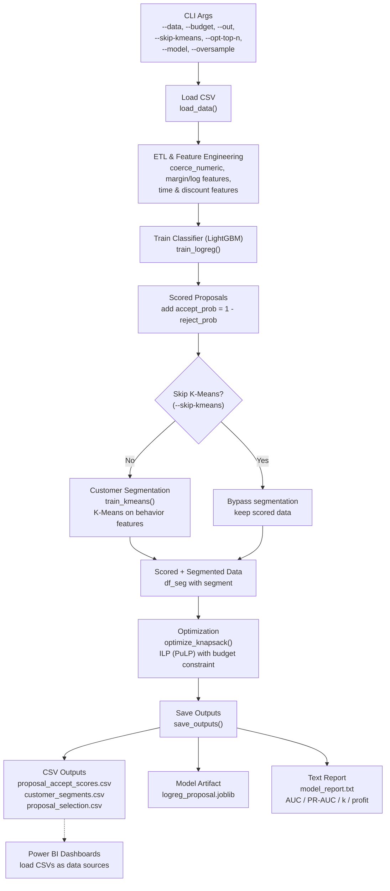
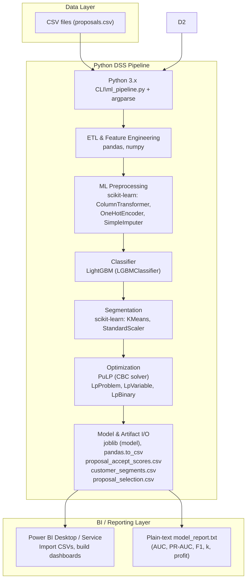

```mermaid

flowchart TD
    A["CLI Args<br/>--data, --budget, --out,<br/>--skip-kmeans, --opt-top-n,<br/>--model, --oversample"] --> B["Load CSV<br/>load_data()"]
    B --> C["ETL & Feature Engineering<br/>coerce_numeric, margin/log features,<br/>time & discount features"]
    C --> D["Train Classifier (LightGBM)<br/>train_logreg()"]
    D --> E["Scored Proposals<br/>add accept_prob = 1 - reject_prob"]

    E --> F{"Skip K-Means?<br/>(--skip-kmeans)"}
    F -- "No" --> G["Customer Segmentation<br/>train_kmeans()<br/>K-Means on behavior features"]
    F -- "Yes" --> H["Bypass segmentation<br/>keep scored data"]

    G --> I["Scored + Segmented Data<br/>df_seg with segment"]
    H --> I

    I --> J["Optimization<br/>optimize_knapsack()<br/>ILP (PuLP) with budget constraint"]
    J --> K["Save Outputs<br/>save_outputs()"]

    K --> L["CSV Outputs<br/>proposal_accept_scores.csv<br/>customer_segments.csv<br/>proposal_selection.csv"]
    K --> M["Model Artifact<br/>logreg_proposal.joblib"]
    K --> N["Text Report<br/>model_report.txt<br/>AUC / PR-AUC / k / profit"]

    L -.-> O["Power BI Dashboards<br/>load CSVs as data sources"]


```

```mermaid
flowchart TB
    %% SYSTEM / TECH STACK

    subgraph L1["Data Layer"]
        D1["CSV files (proposals.csv)"]
    end

    subgraph L2["Python DSS Pipeline"]
        P0["Python 3.x CLI\ml_pipeline.py + argparse"]
        P1["ETL & Feature Engineering\npandas, numpy"]
        P2["ML Preprocessing\nscikit-learn: ColumnTransformer,\nOneHotEncoder, SimpleImputer"]
        P3["Classifier\nLightGBM (LGBMClassifier)"]
        P4["Segmentation\nscikit-learn: KMeans, StandardScaler"]
        P5["Optimization\nPuLP (CBC solver)\nLpProblem, LpVariable, LpBinary"]
        P6["Model & Artifact I/O\njoblib (model), pandas.to_csv\nproposal_accept_scores.csv\ncustomer_segments.csv\nproposal_selection.csv"]
    end

    subgraph L3["BI / Reporting Layer"]
        B1["Power BI Desktop / Service\nImport CSVs, build dashboards"]
        B2["Plain-text model_report.txt\n(AUC, PR-AUC, F1, k, profit)"]
    end

    D1 --> P0
    D2 --> P0
    P0 --> P1 --> P2 --> P3
    P3 --> P4
    P4 --> P5
    P5 --> P6
    P6 --> B1
    P6 --> B2


```